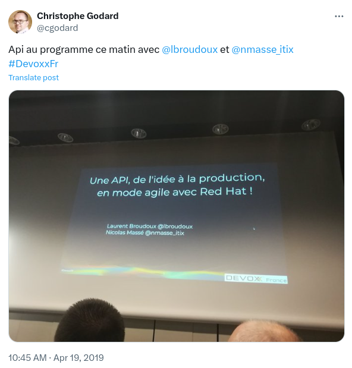
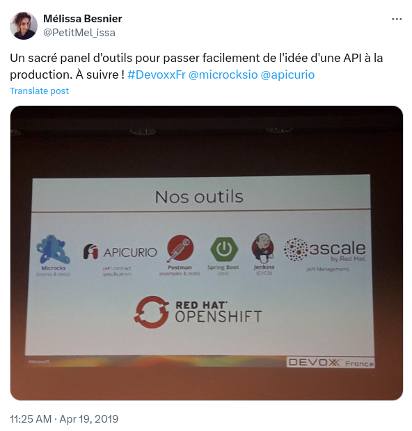

On the 19th April 2019, I spoke at Devoxx France on a session named _"Une API, de l'idée à la production, en mode agile avec Red Hat !"_.

## Pictures

## Attendees' reaction

For more information: https://cfp.devoxx.fr/2019/talk/OWQ-3436/Une_API,_de_l'idee_a_la_production,_en_mode_agile_avec_Red_Hat_!

