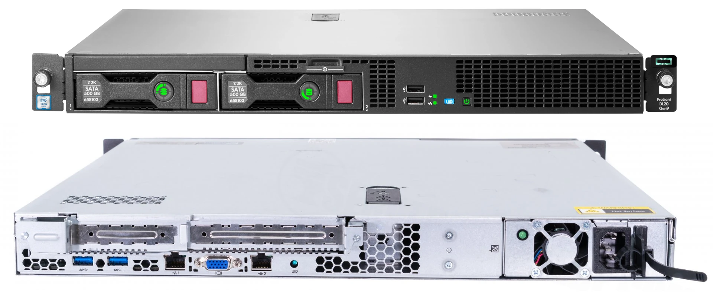
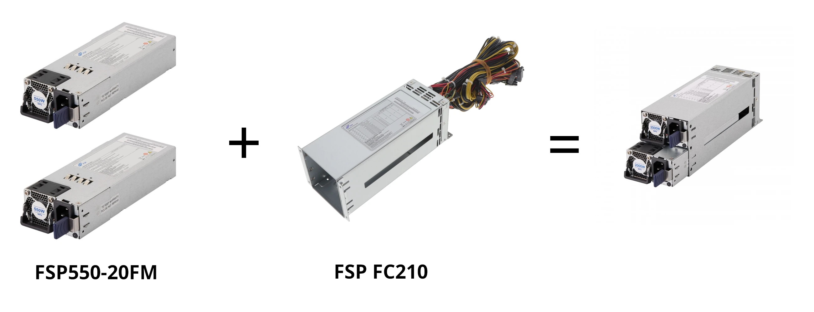
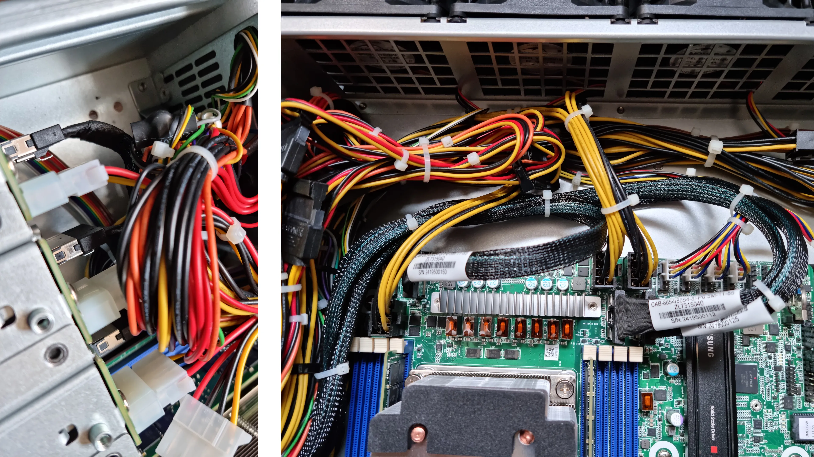
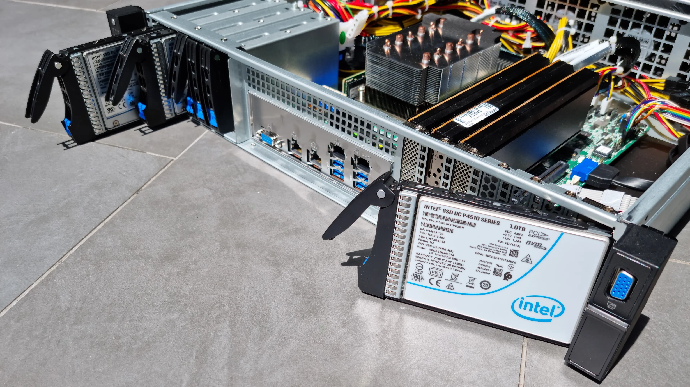
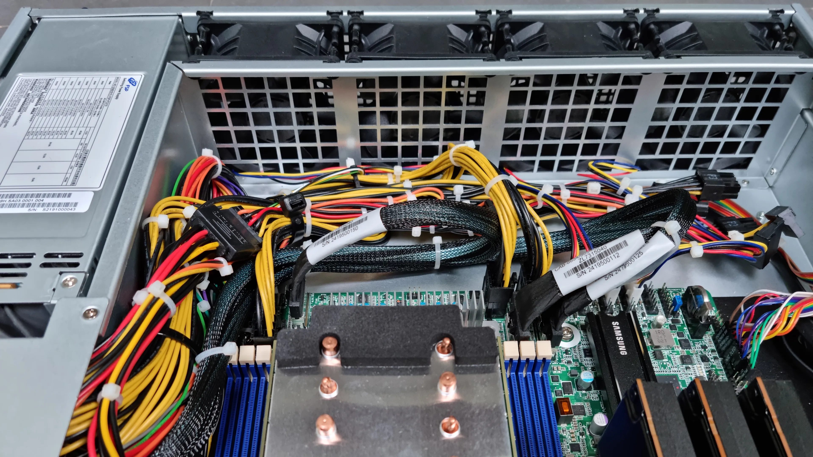
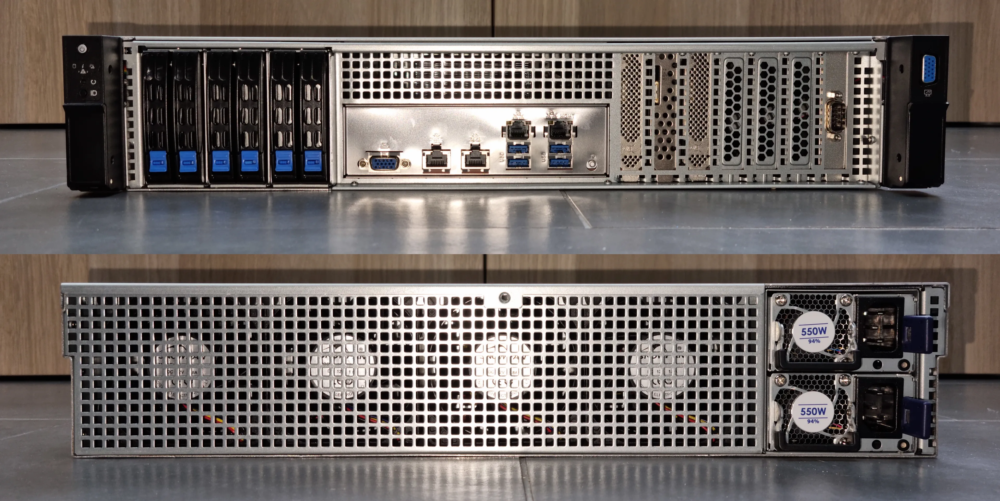
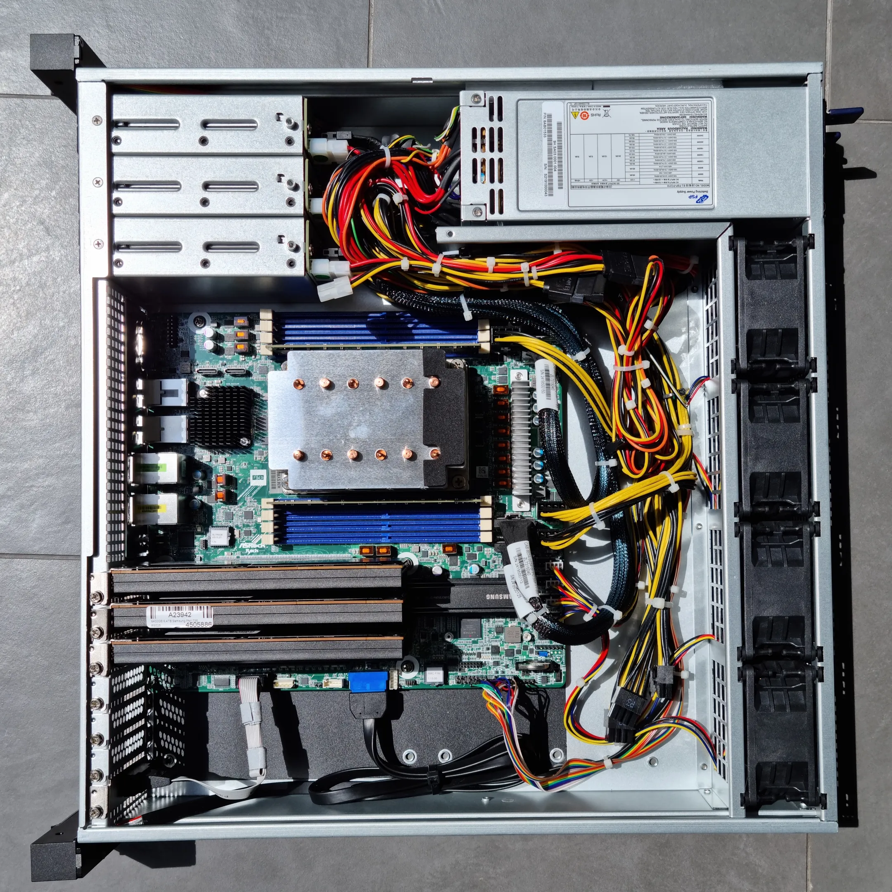
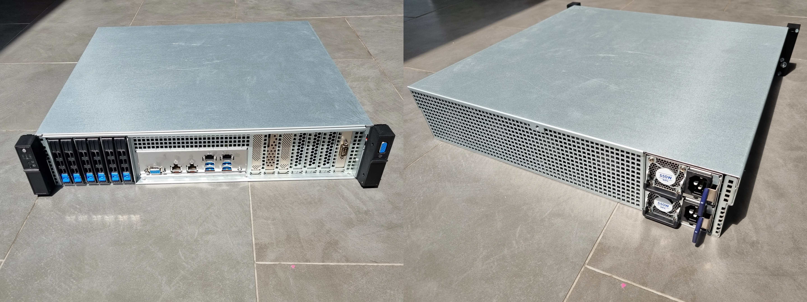

En mars de cette année, j'ai décidé de trouver un nouveau serveur pour héberger les données de la famille (Jellyfin, Nextcloud, etc.), piloter la maison avec Home Assistant et faire tourner les VM dont j'ai besoin pour mon travail.
Dans cet article, je détaille mes contraintes et la construction de ce serveur, sur base d'un CPU **Ampere Altra** (architecture **ARM64**).

<!--more-->

## Existant

J'héberge actuellement mes services sur un serveur **HP DL20 Gen9**, acheté d'occasion en juin 2021 pour 640 €.

Ce serveur **HP DL20 Gen9** est équipé de :

- 1 CPU **Intel Xeon E3-1270 v6** à 4.2 GHz (4C/8T)
- 48 Go de RAM ECC
- 2 disques 3,5" de 4 To chacun, configurés en RAID 1 par la carte RAID HP
- 6 ports RJ-45 à 1 GbE

Ce serveur est actuellement racké dans une baie informatique de 7U de haut, faible profondeur, au sous-sol de la maison et il fait actuellement tourner **CentOS Stream 8** que j'ai configuré en routeur (voir ) et hyperviseur (avec **libvirt**).

L'hyperviseur fait tourner plusieurs VM :

- **Kubernetes** vanilla avec tous les services de la famille (Jellyfin, Nextcloud, etc)
- **Home Assistant**
- Un bastion (**CentOS Stream 8**) pour les connexions SSH entrantes
- Une seedbox (**qBittorrent**)
- Un reverse proxy (**Traefik**) pour dispatcher sur le réseau interne les connexions TLS arrivant sur la seule IPv4 que je possède.
- Le contrôleur **Unifi** qui gère mes switches et points d'accès Wifi

## Limitations du matériel existant et besoins futurs

Entre le moment où j'ai acheté ce **HP DL20 Gen9** et maintenant, mes besoins ont évolué et le contexte technologique a également évolué.

Je n'avais pas anticipé le nombre de services que je ferais tourner dans mon **Kubernetes**.
J'ai à ce jour 54 pods répartis dans 35 namespaces.

À l'époque, j'étais parti sur un **Kubernetes** vanilla mais le temps qui passe m'a prouvé qu'un Kubernetes vanilla demande plus de temps et d'énergie à administrer au quotidien que je n'en ai à offrir.
Je cherche donc à migrer tous mes services sur **OpenShift**.

Les performances des disques durs 3.5" deviennent pénalisants sur les gros transferts de fichier.
La mémoire cache de la carte RAID se remplit rapidement et je plafonne alors au débit famélique des disques durs 3,5" 7200 Tr/min : ~187 Mo/s.

Le CPU, bien que performant à l'époque, ne tient plus la comparaison.
Le CPU **AMD Ryzen 7 7840U** de mon **Framework Laptop 13** a des performances de calcul en virgule flottante 64 % plus élevées que le **Intel Xeon E3-1270 v6** du serveur **HP DL20 Gen9**.

Les 48 Go de RAM actuellement installés me permettent de faire tourner mes services actuels mais pas les services que j'envisage (**OpenShift** notamment).

Les capacités d'expansion du **HP DL20 Gen9** sont bien limitées : 2 emplacements PCIe x8.
L'emplacement pleine hauteur est pris par le contrôleur RAID et l'emplacement demi hauteur est pris par la carte réseau 4 ports GbE.

Dernier point, et non des moindres, la carte mère et le CPU du **HP DL20 Gen9** ne supportent pas le **SR-IOV**. Ça m'oblige actuellement à faire tourner les fonctions de routage réseau directement sur l'hyperviseur.
La fonction SR-IOV me permettrait de mettre le [routeur CentOS Stream](/blog/fibre-orange-remplacer-livebox-routeur-centos-stream-8) dans une VM sans perte de performance.

En résumé, j'ai besoin de :

- Plus de RAM
- Un CPU plus puissant
- Stockage NVMe rapide
- Plus d'emplacements PCIe libres
- SR-IOV

## Facteur de forme

Ce que j'ai aimé dans le **HP DL20 Gen9**, c'est le facteur de forme : 1U faible profondeur.
C'est pratique à stocker dans une armoire informatique fixée au mur et ça ne prend pas de place au sol.
En revanche, pour y mettre tout ce dont j'ai besoin, il faut que je vise un peu plus grand : **format 2U**.

Et c'est sur cette idée que je me suis mis à la recherche du Saint-Graal du *Edge Computing* : un boîtier 2U, *short depth*, *front IO*, *NVMe backplane* et alimentation *CRPS*.

Après autant d'acronymes et de buzzwords, quelques explications s'imposent :

- La hauteur du boitier s'exprime en unité de rack (**U**).
  **2U**, c'est la hauteur minimale requise pour loger une carte PCIe ou un disque NVMe à la verticale et ainsi avoir une bonne densité.
- Dans les projets de *Edge Computing*, les serveurs sont souvent rackés dans de petites armoires informatiques de faible profondeur (60 cm, voir parfois 45 cm), par opposition aux *datacenters* où les armoires sont habituellement plus profondes (120 cm).
  Les serveurs qui rentrent dans ces armoires sont dit **short depth**.
- Ces armoires informatiques sont souvent fixées à un mur, ce qui signifie que l'accès à l'arrière du serveur est difficile : il se fait par les côtés de l'armoire, avec une visibilité limitée.
  Les serveurs qui ont leurs entrées/sorties sur la **face avant** sont dénommés **front IO**.
- Enfin, pour pouvoir loger du stockage flash rapide dans les emplacements **U.2**, il faut que le boîtier soit équipé d'un **backplane NVMe**.
- Les serveurs que l'on trouve sur le marché avec ces caractéristiques nécessitent en général des alimentations électriques au format **CRPS** (*Common Redundant Power Supply*).
  Le format **CRPS** définit la taille des alimentations, les tensions qu'elles délivrent et la communication entre l'alimentation et la carte mère (**SMbus**).

Au sous-sol de la maison, j'ai une armoire informatique de 60 cm de profondeur (**Digitus DN-19 07U-6/6-EC-SW**) dont seulement 45,9 cm sont exploitables pour y loger un serveur.

**Je me suis donc mis en quête d'un serveur *short depth*, *front IO*, avec un *NVMe backplane* et une alimentation *CRPS* !**

## Carte mère ASRock Rack ALTRAD8UD-1L2T

En décembre 2023, **Asrock Rack** a sorti une carte mère serveur supportant les CPU **Ampere Altra** : la [ALTRAD8UD-1L2T](https://www.asrockrack.com/general/productdetail.asp?Model=ALTRAD8UD-1L2T#Specifications).
Cette carte mère a fait sensation dans la presse spécialisée. [Patrick Kennedy](https://www.servethehome.com/author/patrick/) allant jusqu'à titrer "[ASRock Rack ALTRAD8UD-1L2T: C'est la carte Ampere ARM que vous voulez !](https://www.servethehome.com/asrock-rack-altrad8ud-1l2t-review-this-is-the-ampere-arm-motherboard-you-want/)".

En soit, la carte a tout pour plaire :

- Support des CPU Ampere Altra / Ampere Altra Max
- 8 slots de DDR4 (supportant la mémoire ECC), 1 DIMM par *channel*, max 256 Go par DIMM. Soit un maximum de 2 To de RAM.
- 2 slots PCIe 4.0 x16 + 2 slots PCIe 4.0 x8
- 2 slots M.2 2280/2230 (PCIe 4.0 x4)
- 4 connecteurs SlimSAS (PCIe 4.0 x8)
- 2 connecteurs OCuLink (PCIe 4.0 x4)
- Carte réseau Intel X550 avec 2 ports RJ45 (10 GbE)
- Carte réseau Intel i210: 1 port RJ45 (1 GbE)
- Console IPMI

Première difficulté : la carte est au format **Deep Micro-ATX**.
C'est un format un peu hors norme, ça ressemble à du [Micro-ATX](https://fr.wikipedia.org/wiki/Format_ATX), mais avec 2,3 cm de plus en profondeur.
Évidemment, les constructeurs de boîtier n'annoncent pas leur compatibilité avec ce format **Deep Micro-ATX**, car... il n'est pas standard ! 😡

La difficulté, c'est ensuite de se procurer le processeur qui va avec !
Les CPU Ampere Altra sont quasi introuvables sur les sites de vente de matériel high-tech en ligne. 😱

## Processeur Ampere Altra Q64-22

Fort heureusement, [Asrock Rack](https://www.asrockrack.com/), [Ampere Computing](https://amperecomputing.com/) et [Newegg](https://www.newegg.com/) (comme LDLC mais aux États-Unis ?) se sont associés pour rendre tout cela possible pour la communauté "Homelab".

Newegg propose deux *bundles* sur son site :

- [ASRock Rack ALTRAD8UD-1L2T + Ampere Altra Q64-22](https://www.newegg.com/asrock-rack-altrad8ud-1l2t-q64-22-ampere-altra-max-ampere-altra-processors/p/N82E16813140134)
- [ASRock Rack ALTRAD8UD-1L2T + Ampere Altra M128-26](https://www.newegg.com/asrock-rack-altrad8ud-1l2t-q64-22-ampere-altra-max-ampere-altra-processors/p/N82E16813140135)

Et les deux bundles incluent le dissipateur thermique compatible avec les boitiers 2U. 🥳

J'ai choisi le **Ampere Altra Q64-22** car il me permet de ne pas faire exploser le budget.
Et je me dis que quand j'aurai utilisé les 64 cœurs du CPU, de l'eau aura coulé sous les ponts et on trouvera peut-être des Ampere Altra Max à 128 cœurs sur eBay pour un prix raisonnable.
Il sera alors toujours temps de passer sur un CPU plus puissant.

Le CPU **Ampere Altra Q64-22** a un TDP de 69 W d'après la [fiche technique Ampere Altra](https://d1o0i0v5q5lp8h.cloudfront.net/ampere/live/assets/documents/Altra_Rev_A1_DS_v1.27_20220331.pdf).

Autre difficulté, c'est que j'habite en France et Newegg ne livre pas en France...
J'ai donc dû passer par un *reshipper* : une entreprise aux États-Unis qui réceptionne les colis et les réexpédie partout dans le monde.

## Le *reshipper*, un intermédiaire incontournable

Je suis passé par [Ship7](https://www.ship7.com/fr) qui m'avait l'air d'être honnête et pas trop cher.
Ce qui va bien sans dire va toujours mieux quand on le dit : entre le coût de Ship7, le coût du transporteur qui va acheminer le colis jusqu'en France et les taxes pour passer la douane, il est illusoire de faire son shopping aux US en imaginant payer moins cher qu'en France. C'est tout le contraire ! En revanche, pour du matériel introuvable de ce côté de l'atlantique, ça dépanne bien !

La procédure pour utiliser le service du *reshipper* est plutôt simple :

- Je me suis créé un compte sur [Ship7](https://www.ship7.com/fr)
- Ship7 m'a donné un numéro de suite et l'adresse de son entrepôt
- Sur le site de Newegg, au moment de passer commande, j'ai donné l'adresse de l'entrepôt Ship7 et j'ai mis mon numéro de suite dans le champ *Full Name* et dans la deuxième ligne de l'adresse.
  (Le numéro de suite, c'est ce qui permet à Ship7 de mettre mes colis dans la bonne case quand ils arrivent dans leur entrepôt)
- Une fois les colis arrivés chez Ship7, j'ai reçu une notification par mail et j'ai pu programmer leur expédition par UPS jusque chez moi.

Il est à noter que Ship7 s'occupe d'imprimer les documents pour la douane mais j'ai dû déclarer le montant exact des objets contenus dans le colis.
À cette étape, il faut faire attention de ne pas se tromper.

Si je ne mets pas le bon prix, le montant des droits de douane ne sera pas le bon :

- Un montant trop élevé et je vais payer des droits de douane trop importants.
- Un montant trop faible et je risque de payer trop peu de frais de douane.
- Le bon montant, c'est celui qui figure sur la facture Newegg (hors frais de port).

## Boîtier Innovision M24306

Trouver le boîtier a été l'étape la plus chronophage et la plus fastidieuse, et ce pour plusieurs raisons :

- Mes besoins m'ont orienté vers des boîtiers typés "Edge Computing" qui étaient peu nombreux, souvent en rupture et livrables uniquement à un adresse professionnelle, avec un numéro de TVA valide. 😭
- La carte mère que j'ai choisie est au format **Deep Micro-ATX**, qui est non standard.
  Et il est difficile d'estimer la compatibilité d'un boîtier avec ce format sur la base de photos (souvent non contractuelles). 🤔
- Les boîtiers que j'ai pu trouver nécessitent souvent une alimentation au format **CRPS**, qui ne sont pas faciles à trouver et peu de documentation existe à ce sujet. 😡

Avant de me décider à acheter le boîtier [Innovision M24306](http://iovserver.com/2u-server-case/m24306.html), j'ai évalué d'autres boîtiers dont je laisse ci-dessous les références au cas où le boîtier que j'ai choisi ne serait plus disponible.

- [Chenbro RM252 FIO](https://www.chenbro.com/en-global/products/RackmountChassis/2U_Chassis/RM252), référence **RM25206H02\*15621**
- [AIC RMC-2E](https://www.aicipc.com/en/productdetail/51295), référence **XE1-2E000-04**

Le boîtier **Innovision M24306** est trouvable sur [Aliexpress](https://www.aliexpress.us/item/1005005856237609.html) et [Alibaba](https://www.alibaba.com/product-detail/Ultra-Short-2U-rackmount-Server-Chassis_1600636420062.html).

Quelques remarques utiles (j'ai demandé des clarifications avant de passer commande) :

- Les 4 ventilateurs 8038 sont livrés avec le boîtier.
- L'alimentation au format CRPS est à acheter séparément.
- Les 6 *caddies* SFF sont livrés avec le boîtier.
- Le type de *backplane* (**NVMe**) est à spécifier au moment de la commande.
- Les câbles pour relier le *backplane NVMe* à la carte mère sont à acheter séparément.

Note : la prise VGA que l'on voit sur l'oreille droite du serveur n'est connectée à rien du tout.
Mais ce n'est pas gênant dans le sens où le boîtier a ses entrées/sorties sur la face avant donc la prise VGA est déjà sur la face avant et n'a pas besoin d'être déportée.

## Alimentation CRPS FSP

Le boîtier **Innovision M24306** a un emplacement prévu pour l'alimentation au format **CRPS 1+1**.
**CRPS** signifie *Common Redundant Power Supply* et c'est un standard élaboré par le groupe de travail [Modular Hardware System](https://www.opencompute.org/projects/mhs) du consortium **Open Compute**.
Il définit, entre autres, les dimensions et les tensions des alimentations redondantes pour serveurs.
C'est un standard qui semble relativement récent (la v1.0 date de juillet 2023).

Le terme **1+1** signifie que l'alimentation est redondante et qu'elle peut tolérer la panne d'un équipement sur les deux.

Contrairement aux alimentations ATX qui sont d'un seul bloc, les alimentations CRPS sont composées de trois parties :

- Deux modules qui convertissent le courant alternatif 230V en courant continu 12V.
  Ces deux modules sont identiques et interchangeables.
  Si l'un des deux modules tombe en panne, le second peut prendre le relais.
- Un module dont la tâche est d'ajuster la tension 12V vers les autres tensions requises par les composants du serveur (3.3V, 5V, etc.) et d'effectuer la bascule en cas de panne.

Si vous voulez en apprendre plus sur ce standard, je vous invite à lire les spécifications publiées sur [le wiki Open Compute](https://www.opencompute.org/w/index.php?title=Server/MHS#Current_Status).

J'ai identifié deux marques fabriquant des alimentations CRPS et avec un bon réseau de distributeurs : [FSP](https://www.digikey.fr/en/ptm/f/fsp-technology/common-redundant-power-supply-series) et [Athena Power](http://athenapower.com/product/power-supply/redundant/ap-rru2m5562).
J'ai choisi la *Power Distribution Board* [FSP-FC210](https://www.fsp-group.com/download/pro/FSP-FC210FSP-FC210E_Datasheet.pdf) car c'était le modèle qui avait le plus de chance de rentrer dans le boitier.
Et j'ai eu le nez fin !
Le modèle [FSP-FC250](https://www.fsp-group.com/download/pro/FSP-FC250_Datasheet.pdf), un peu plus haut de gamme, a l'avantage d'être modulaire mais il est 4 cm plus profond et ne serait pas rentré dans le boîtier.

J'ai ensuite opté pour le module d'alimentation de la plus petite puissance disponible car 2 x 550W, ça fait déjà beaucoup pour un petit serveur !
C'est le modèle [FSP550-20FM](https://www.fsp-group.com/download/pro/FSP550-20FM_Datasheet.pdf).

Il est à noter que la *Power Distribution Board* n'est fixée au boîtier que par deux petites vis.
Pour éviter qu'elle ne bouge, j'ai dû la caler avec un morceau de mousse.
Une fois tout en place, ça ne se voit pas. 😎

Dans la fiche technique du constructeur, je n'ai pas réussi à trouver le détail des prises connectées à la **FSP-FC210**.
Pour ceux qui se poseraient la question, la *Power Distribution Board* **FSP-FC210** est équipée de :

- 1 prise PMbus
- 1 prise ATX 24 broches
- 6 prises SATA
- 7 prises PCIe 12V

## Câbles SlimSAS PCIe 4.0

Pour relier le *backplane* NVMe à la carte mère, j'ai dû trouver le câble adéquat.
Le connecteur sur la carte mère et sur le *backplane* sont du même type : **SlimSAS** / **SFF-8654**.

La référence **CAB-8654/8654-8i-11-P0.5M-85** chez [10Gtek](https://www.10gtek.com/8654) a toutes les caractéristiques requises :

- Les câbles SlimSAS sont disponibles en deux largeurs : *4 lanes* (**4i**) ou *8 lanes* (**8i**).
  Aussi bien la carte mère que le *backplane* sont en *8 lanes* (**8i**).
- Les câbles sont disponibles en deux impédances : 85 ohms ou 100 ohms.
  Il semblerait que pour faire transiter des signaux PCIe, il faille choisir la version **85 ohms**.
- Différentes longueurs sont proposées, j'ai choisi des câbles de **50 cm**.
- Enfin, il est possible d'opter pour des connecteurs coudés ou droits.
  J'ai pris les **connecteurs droits**.

## Stockage

Pour le stockage, j'aurais aimé utiliser les 6 emplacements U.2 du *backplane NVMe*.
C'était un de mes critères.
Mais acheter 3 à 6 SSD du modèle que je visais (Samsung PM1733) aurait fait exploser mon budget.

J'ai alors décidé de réutiliser 3 SSD NVMe **Samsung PM1735**, de 6.4 To chacun, que j'avais par ailleurs dans mon *homelab*.
J'avais acheté ces SSD à un époque où ils étaient moins chers qu'actuellement.
Ces SSD sont au format *Add-in Card (AIC)*, demi-hauteur, demi-longueur (**HHHL**), ce qui me prend 3 emplacements PCIe sur les 4 que possède la carte mère.
Mais dans l'immédiat, ça me permet d'avancer.
Et si je trouve une enchère eBay avec un lot de SSD Samsung PM1733 à bon prix, je n'aurais qu'à transférer les données sur les nouveaux SSD pour récupérer 3 emplacements PCIe.

Il est à noter que les SSD **Samsung PM1733A** ont été testés par la société **Ampere Computing** et ont montré de bonnes performances avec leur CPU ! Voir [Samsung FIO Performance - Solution Brief](https://amperecomputing.com/briefs/samsung-FIO-performance).

J'ai ajouté à cela un SSD NVMe au format M.2 pour héberger le système d'exploitation : un **Samsung SSD 980 PRO** (équipé d'un dissipateur thermique).

Par soucis du détail, j'ai quand même testé 6 SSD NVMe au format U.2 (PCIe 3.0) sur le *backplane NVMe* du boîtier. Ça fonctionne ! En revanche, je n'ai pas testé le branchage/débranchage à chaud (*hotplug*) car je ne pense pas que le *backplane* de ce boîtier ait implémenté la fonctionnalité.

## Nomenclature

Pour qui voudrait se construire un serveur à l'identique, j'ai rassemblé la liste du matériel à acheter.
Dans les colonnes "Désignation" et "Distributeur", j'ai mis les liens vers la fiche technique du fabricant ainsi que le distributeur par lequel je suis passé pour acheter le matériel.

| Categorie         | Désignation                                                               | Distributeur | Quantité | Prix total |
| ----------------- | ------------------------------------------------------------------------- | ----- |:--------:| ----------:|
| Carte mère | [ASRock Rack ALTRAD8UD-1L2T + Ampere Altra Q64-22 64](https://www.asrockrack.com/general/productdetail.asp?Model=ALTRAD8UD-1L2T) | [Newegg](https://www.newegg.com/asrock-rack-altrad8ud-1l2t-q64-22-ampere-altra-max-ampere-altra-processors/p/N82E16813140134) | 1 | 1500,00 $ |
| RAM | [Micron 64GB DDR4 3200 8Gx72 ECC CL22 RDIMM](https://www.crucial.com/memory/server-ddr4/mta36asf8g72pz-3g2r) | [Newegg](https://www.newegg.com/micron-64gb-288-pin-ddr4-sdram/p/1FR-009G-00004) | 2 | 310,00 $ |
| Boîtier | [Innovision M24306 with NVMe backplane](https://www.iovstech.com/2u-server-case/m24306.html) | [Alibaba](https://www.alibaba.com/product-detail/Ultra-Short-2U-rackmount-Server-Chassis_1600636420062.html) | 1 | 256,00 $ |
| Alimentation | [FSP FC210 Power Distribution Board](https://www.fsp-group.com/download/pro/FSP-FC210FSP-FC210E_Datasheet.pdf) | [Digikey](https://www.digikey.com/en/products/detail/fsp-technology-inc/FSP-FC210/16164277) | 1 | 145,90 € |
| Alimentation | [FSP 550-20FM AC/DC Converter 12V 500W](https://www.fsp-group.com/download/pro/FSP550-20FM_Datasheet.pdf) | [Digikey](https://www.digikey.com/en/products/detail/fsp-technology-inc/FSP550-20FM/16164275) | 2 | 277.02 € |
| Câble | [10Gtek SFF-8654 8i Cable, SAS 4.0, 85 ohm, 0.5 meter](https://www.10gtek.com/8654) | [10Gtek](https://www.10gtek.com/8654) | 3 | 89,00 $ |
| Câble | [StarTech.com 9 Pin Serial Male to 10 Pin Motherboard Header LP Slot Plate](https://www.startech.com/en-us/cables/plate9mlp) | [Amazon](https://www.amazon.fr/StarTech-com-PLATE9MLP-Plaque-broches-encombrement/dp/B001EHFV02/) | 1 | 5,52 € |
| Câble | Molex to to Dual SATA Power Adapter Splitter | [Amazon](https://www.amazon.fr/gp/product/B07QWX3G26/) | 2 | 4,99 € |
| Stockage | [Samsung SSD 980 PRO M.2 PCIe NVMe 2 To](https://www.samsung.com/fr/memory-storage/nvme-ssd/980-pro-with-heatsink-2tb-nvme-pcie-gen-4-mz-v8p2t0cw/) | [LDLC](https://www.ldlc.com/fiche/PB00475439.html?offerId=AR202110130112) | 1 | 196,90 €   |
| Stockage | [Samsung SSD PM1735 6.4 TB](https://semiconductor.samsung.com/ssd/enterprise-ssd/pm1733-pm1735/) | [eBay](https://www.ebay.com/sch/175669/i.html?_from=R40&_nkw=MZPLJ6T4HALA-00007) | 3 | 1694,00 € |

Avec un taux de change à 1 USD = 0,93 EUR, on arrive à un total de **4 328,48 €**.
Et dans ce prix, je n'ai pas compté les frais de port, les droits de douane, etc. 💸

## Refroidissement

Il est à noter que, par défaut, le flux d'air des ventilateurs des alimentations **FSP 550-20FM** et du boîtier **Innovision M24306** sont inversés : les ventilateurs des alimentations soufflent dans le sens **avant -> arrière** alors que les ventilateurs du boîtier soufflent dans le sens **arrière -> avant**.
Fort heureusement, les ventilateurs du boîtier sont réversibles.

Je n'ai pas encore fait de test de performance, mais les températures mesurées sont plus basses avec ce flux d'air optimisé.
C'est au niveau des 6 SSD NVMe à gauche que l'effet est le plus notable.
En effet, ils ne sont refroidis que par les ventilateurs des alimentations.

Le boitier est prévu pour des cartes mères à 7 emplacements PCIe alors que l'**ASRock Rack ALTRAD8UD-1L2T** n'en a que 4.
Les trois emplacements inutilisés peuvent être masqués pour forcer le flux d'air à passer là où il sera plus utile.

## Résultat

L'aspect extérieur du produit est plutôt flatteur, presque professionnel.

L'intérieur est moins bien agencé qu'un serveur HP ou Dell mais je saurais m'en satisfaire. 😎

Dernières photos, cette fois-ci avec le couvercle en place, prêt à être racké ! 🚀

## Conclusion

Je suis parti sur une architecture ARM64 car elle répondait à mon besoin mais surtout j'avais envie de monter en compétence sur ce sujet.
Et clairement je n'ai pas été déçu !
J'ai énormément appris en assemblant ce serveur 2U sur base d'Ampere Altra (architecture ARM64).

Et si vous vous lancez dans l'aventure, venez en discuter sur le [forum Ampere Computing](https://community.amperecomputing.com/u/nmasse-itix/activity) !
