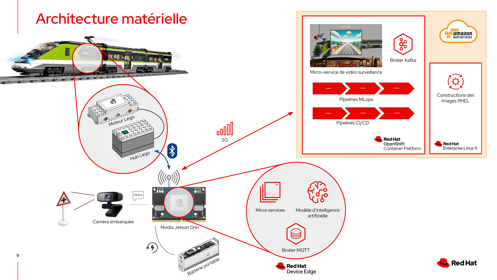

Le 28 Mai 2024, j'ai participé à l'événement [Platform Day](https://events.redhat.com/profile/form/index.cfm?PKformID=0x10564585e99) [💾](https://web.archive.org/web/20240626100519/https://events.redhat.com/profile/form/index.cfm?PKformID=0x10564585e99) durant lequel j'ai co-présenté la démo **Mission Impossible**, combinant **Edge Computing** et **Intelligence Artificielle**.

## Scénario

La démo mets en scène l'équipe du film **Mission Impossible** qui a fait une halte inattendue au Pavillon Royal pour offrir aux invités un aperçu de l'une des scènes les plus audacieuses du nouvel épisode.
Le film met en vedette Ethan Hunt et son équipe, qui doivent déjouer un complot visant à prendre le contrôle des Kubernetes de la planète. 😄


Les personnages principaux de cette mission sont :

- **Mourad**, le développeur de l'application,
- **Adrien**, le Data Scientist,
- **Nicolas**, le spécialiste Edge,
- **Pauline**, la directrice de l'agence.

Pauline a décrit les défis auxquels l'équipe est confrontée : **arrêter un train fou avant qu'il ne déraille**. 😱
Pour ce faire, nous devons connecter une carte Nvidia Jetson Orin au réseau informatique du train et **déployer une IA capable de reconnaître les panneaux de signalisation**.

Le train en question était en fait un train [Lego City #60337](https://www.lego.com/fr-fr/product/express-passenger-train-60337).

## Mon rôle

Dans cette mission, mon rôle a consisté à **prendre le contrôle du train**.

Le train est équipé d’un moteur et d’un Hub Lego.
Le Hub Lego reçoit les ordres d’accélération, décélération et freinage via le protocole **Bluetooth Low Energy**.



Nous avons intégré une carte **Nvidia Jetson Orin** dans le train Lego.
La carte Nvidia Jetson Orin est un *System on Chip* (SoC) qui intègre tous les composants nécessaires à notre mission : CPU, RAM, stockage et un puissant GPU pour accélérer les calculs.
Cette carte reçoit le flux vidéo de la caméra embarquée et transmet les ordres au **Hub Lego** via le protocole **Bluetooth**.
Elle est alimentée par une batterie portable pour la durée de la mission.

Nous opérons dans un environnement de *Edge Computing*.
Sur la carte Nvidia Jetson, nous installons **Red Hat Device Edge**, une variante de RHEL adaptée aux contraintes du *Edge Computing*.
Nous y déployons **Microshift**, la version de Kubernetes de Red Hat conçue pour le *Edge*.
Ensuite, nous déployons nos microservices, un broker MQTT et le modèle d'intelligence artificielle sur Microshift, en utilisant un mécanisme "over-the-air".

Pour la durée de la mission, le Jetson est connecté à un cluster **OpenShift** dans le cloud AWS via une connexion 5G.
Dans le cloud AWS, nous disposons d'une machine virtuelle RHEL 9 qui nous permet de construire nos images RHEL pour le Jetson.
Notre application de vidéo surveillance fonctionne dans le cluster OpenShift, ce qui nous permet de surveiller à distance la caméra embarquée du train.
Le flux vidéo est relayé depuis le Jetson via un **broker Kafka**.

De plus, des pipelines MLOps sont mis en place pour entraîner le modèle d'intelligence artificielle, ainsi que des pipelines CI/CD pour construire les images de conteneurs de nos microservices pour les architectures x86 et ARM.


Durant cette mission, j'ai fait face à trois principaux défis.

Le **premier défi** a été la communication Bluetooth avec le Hub Lego.
Nous avons utilisé pour cela la bibliothèque Open Source [Node-PoweredUp](https://github.com/nathankellenicki/node-poweredup) qui s'appuie sur la bibliothèque [noble](https://github.com/abandonware/noble) pour la gestion du protocole Bluetooth.
Et cette dernière bibliothèque utilise le support Bluetooth HCI du noyau Linux, alors que depuis environ dix ans le support Bluetooth sous Linux utilise l'API DBUS de BlueZ !
Il a donc fallu implémenter les *bindings* DBUS dans la bibliothèque **noble**.
J'ai pour cela utilisé une autre bibliothèque, nommée [node-ble](https://github.com/chrvadala/node-ble).

Le code que j'ai écrit est Open Source et disponible sur GitHub mais l'inclusion par les communautés *upstream* prend du temps.
En attendant, vous pouvez utiliser les versions patchées des trois bibliothèques :

- [node-poweredup](https://github.com/Demo-AI-Edge-Crazy-Train/node-poweredup/tree/noble-fork)
- [noble](https://github.com/Demo-AI-Edge-Crazy-Train/noble/tree/bluez-dbus-bindings)
- [node-ble](https://github.com/Demo-AI-Edge-Crazy-Train/node-ble/tree/noble-requirements)

Pour les utiliser dans vos projets, c'est tout simple.
Il suffit d'ajouter la dépendance vers la bibliothèque **node-poweredup** patchée dans votre **package.json** :

```json
{
  "dependencies": {
    "node-poweredup": "Demo-AI-Edge-Crazy-Train/node-poweredup#noble-fork"
  }
}
```


Le **second défi** a été de préparer des images du système d'exploitation (**Red Hat Enterprise Linux 9**), adaptées pour la carte **Nvidia Jetson Orin Nano**.
Pour cela, j'ai utilisé l'outil [composer-cli](https://docs.redhat.com/en/documentation/red_hat_enterprise_linux/9/html/composing_installing_and_managing_rhel_for_edge_images/composing-a-rhel-for-edge-image-using-image-builder-command-line_composing-installing-managing-rhel-for-edge-images#network_based_deployments_workflow).

Une version a minima 9.4 de RHEL est indispensable pour avoir un support matériel à jour sur la carte Nvidia Jetson Orin Nano.
Or cette version était encore en *beta* lors de la préparation de cette démo.
Il a donc fallu créer une image AMI sur AWS à partir des images fournies par Red Hat, l'utiliser pour provisionner une VM EC2 et configurer **composer-cli** pour utiliser cette version de RHEL.
Le blueprint et les scripts sont dans le dépôt Git [rhde-nvidia-jetson-orin](https://github.com/Demo-AI-Edge-Crazy-Train/rhde-nvidia-jetson-orin).

Lorsque nous avons préparé la démo, les modules noyau Nvidia n'étaient pas Open Source.
Il a donc fallu récupérer auprès de l'*engineering* RHEL les modules noyau Nvidia, compilés pour la *beta* de RHEL 9.4.

Le **dernier défi** a été de concevoir des **pipelines CI/CD** pour créer des images de conteneur multi-architecture.
En effet, les puces M1 d'Apple ont une architecture **arm64**, les PC sont en **x86_64**.
Idem, les tests d'intégration sont souvent exécutés sur des serveurs dans le cloud (**x86_64**) alors que le déploiement se fait sur la carte Nvidia Jetson Orin Nano (**arm64**).
J'ai détaillé la procédure complète dans l'article intitulé [](/blog/build-multi-architecture-container-images-with-kubernetes-buildah-tekton-aws/index.md).

## Genius Bar

L'après-midi, nous avons animé un atelier *Genius Bar*, où beaucoup de participants sont venus nous voir, ont posé des questions, essayé d'imaginer une suite possible de la démo ou tout simplement partagé leur expérience personnelle.
L'afflux était tel que nous n'avons pas trouvé 5 minutes pour démarrer le train.
C'était intense ! 🥵


## Conclusion

La démonstration, réalisée en direct, a montré la robustesse et l’efficacité des technologies présentées.
Les invités ont pu voir en temps réel le train Lego s’arrêter en présence des panneaux de signalisation, grâce au modèle d'Intelligence Artificielle.
Nous avons expliqué en détail les défis techniques et les solutions mises en place pour assurer le succès de la mission.

L'événement a été un franc succès, offrant une parfaite combinaison de divertissement et d'innovation technologique.
Vous pouvez regarder la démo en replay si le coeur vous en dit.


