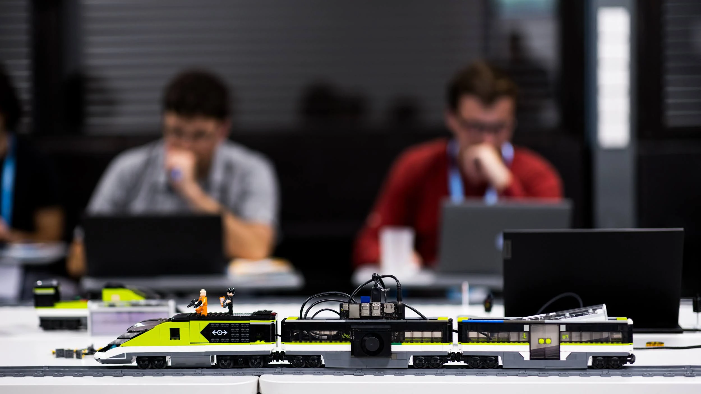
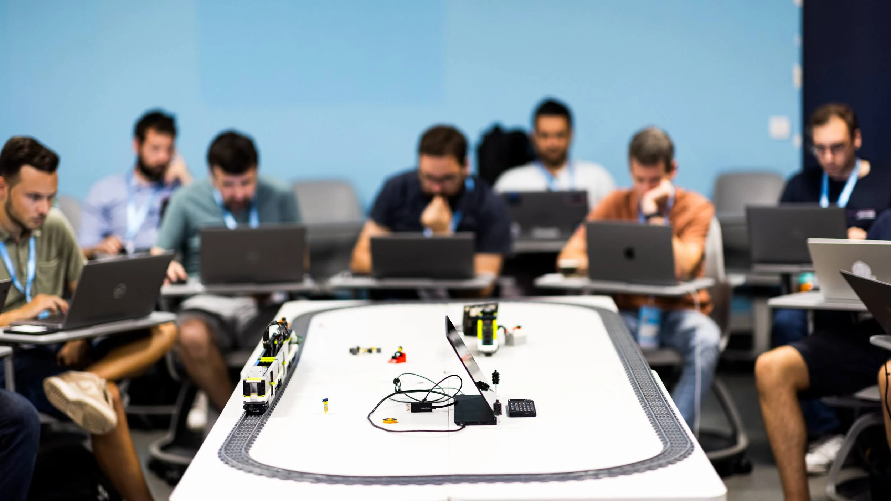
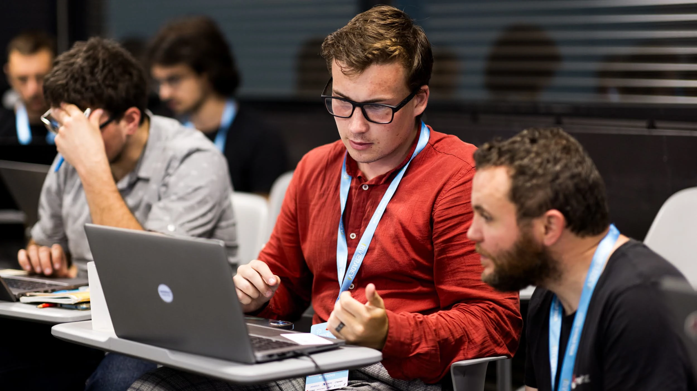
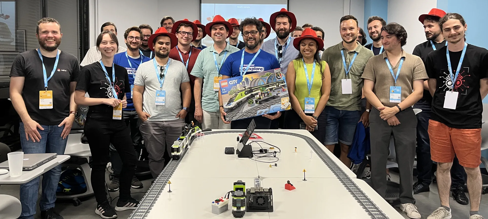
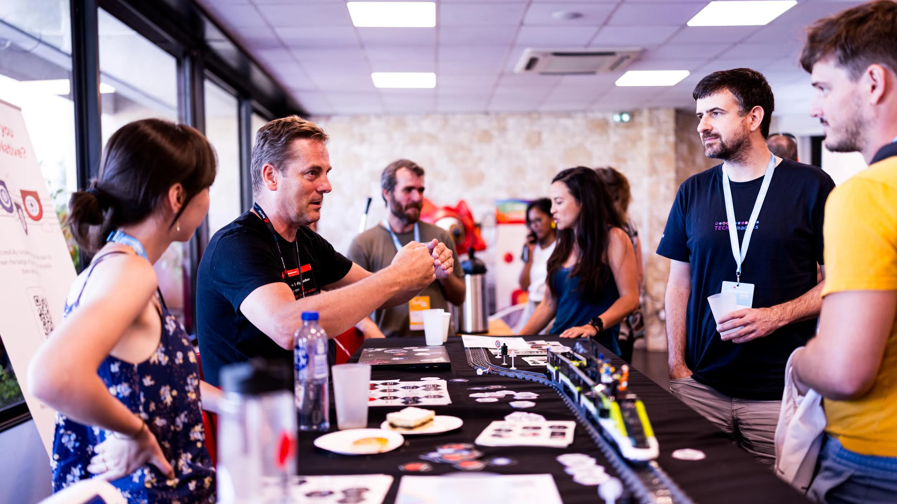

Le 8 Juillet 2024, j'ai participé à l'événement [Riviera Dev](https://2024.rivieradev.fr/) durant lequel j'ai animé, avec mes collègues Adrien, Mourad, Pauline, Sébastien et Laurent un [atelier](https://2024.rivieradev.fr/session/206) combinant **Edge Computing** et **Intelligence Artificielle**.

L'énoncé de l'atelier est basé sur le scénario du 7ème opus de la saga **Mission Impossible: Dead Reckoning**... avec un train Lego !
**Ethan Hunt** a besoin d'aide pour arrêter le train.
Grâce un modèle d'intelligence artificielle conçu dans **OpenShift AI** et déployé sur un **Nvidia Jetson Orin** faisant tourner **Red Hat Device Edge**, le train reconnait les panneaux de signalisation et s'arrête tout seul !

[L'énoncé de l'atelier](https://rivieradev2024-crazytrain.netlify.app/) est composé de trois parties :

1. Entraînement du modèle d'IA pour reconnaître les panneaux de signalisation Lego
2. Développement des micro-services pour appeler le modèle d'IA et envoyer les ordres au Hub Lego
3. Pipelines CI/CD et déploiement dans un environnement de test

L'entraînement du modèle d'IA a fait appel à **OpenShift AI** et les participants ont pu toucher du doigt les différentes étapes de l'entraînement :

- Récupération du jeu de données (depuis un bucket S3) sur lequel sera entraîné le modèle.
- Utilisation d'un notebook **Jupyter** pour générer des données synthétiques et entraîner le modèle.
- Exécution d'un pipeline de MLops pour entraîner le modèle en exploitant les ressources de type GPU, présentes dans le cluster **OpenShift**.
- Test d'inférence du modèle en utilisant la fonction de *Model Serving* présente dans **OpenShift AI**.

La partie développement est un "exercice à trou" : c'est le code de notre démonstration dans lequel certaines fonctions ont été enlevées.
Dans cette partie, le plus intéressant à relater est sous le capot.
En effet, nous n'avions pas le budget pour acheter une boîte de Lego et un Jetson Orin Nano pour chaque participant.
Nous avons donc pris la décision de bouchonner les parties "capture du flux vidéo" et "communication bluetooth".

Pour le participants, ça avait l'effet de bord positif de ne requérir aucun pré-requis sur le poste du développeur : toute la partie développement se fait dans **OpenShift DevSpaces** (l'équivalent de GitPod pour OpenShift).
Des fichiers vidéos sont stockés dans Git et sont utilisés à la place de la webcam.
La communication avec le Hub Lego est remplaçée par l'affichage des ordres qui aurait été envoyés si le Hub était présent.

Enfin, la partie DevOps était composé de deux étapes :

- Exécution des pipelines CI/CD multi-architecture pour construire les images de conteneur des micro-services.
- Déploiement des micro-services dans un environnement de test (avec les bouchons).

Si l'atelier s'est globalement bien passé, nous avons eu la surprise de constater un problème de lecture du flux vidéo chez quasiment tout les participants.
Le symptôme que nous avions était une WebSocket connectée mais vide.
Après investigation, il semblerait que le problème soit lié à un logiciel de sécurité installé sur les machines des participants.

L'atelier s'est terminé avec un Quizz de connaissances et le vainqueur s'est vu remettre un [set Lego #60337](https://www.lego.com/fr-fr/product/express-passenger-train-60337) (le même train que celui de notre démo).

Participer à cet atelier lors du Riviera Dev 2024 a été une expérience enrichissante et mémorable.
Non seulement nous avons pu pratiquer sur deux sujets du moment : Edge Computing et Intelligence Artificielle, mais nous avons également offert aux participants une approche ludique à travers le prisme de la saga Mission Impossible.
Les défis rencontrés, notamment les soucis de lecture du flux vidéo, ont ajouté un peu de piment et d'émulation collective à l'exercice.

Au-delà des compétences techniques acquises, l'enthousiasme et la bonne humeur des participants ont fait de cet atelier un moment de partage et d'apprentissage.
Le quizz final a apporté une touche de compétition amicale et le prix (un set [Lego City #60337](https://www.lego.com/fr-fr/product/express-passenger-train-60337)) décerné au vainqueur a visiblement rendu ce dernier très heureux !
J’espère que cet atelier incitera d'autres développeurs à explorer les possibilités que nous offre la combinaison de l’IA et de l’Edge Computing.
Merci à tous les participants pour leur engagement et leur curiosité, et à l'année prochaine pour de nouvelles aventures technologiques !

En dehors de l'atelier, il y a eu également une forte affluence sur le stand Red Hat où nous avions installé le train et ses rails.
Ce fût l'occasion d'échanger sur les projets Edge et IA en cours ainsi que sur les technologies utilisées.

A l'année prochaine !
